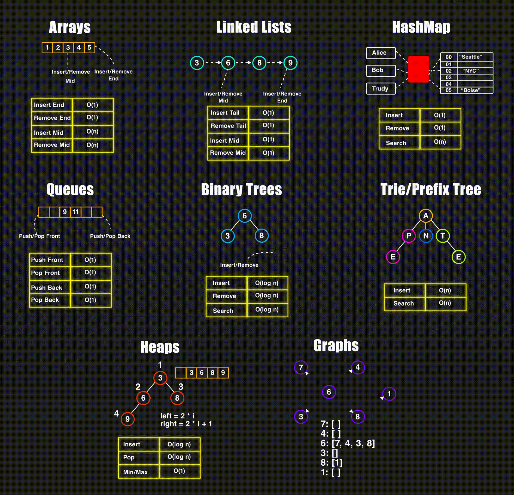

# Rust datastructures

.gif made by https://www.reddit.com/user/NeetCode/
source: https://www.reddit.com/r/leetcode/comments/1i7bluy/8_most_common_data_structures_high_resolution_in/

## Array:
desc
